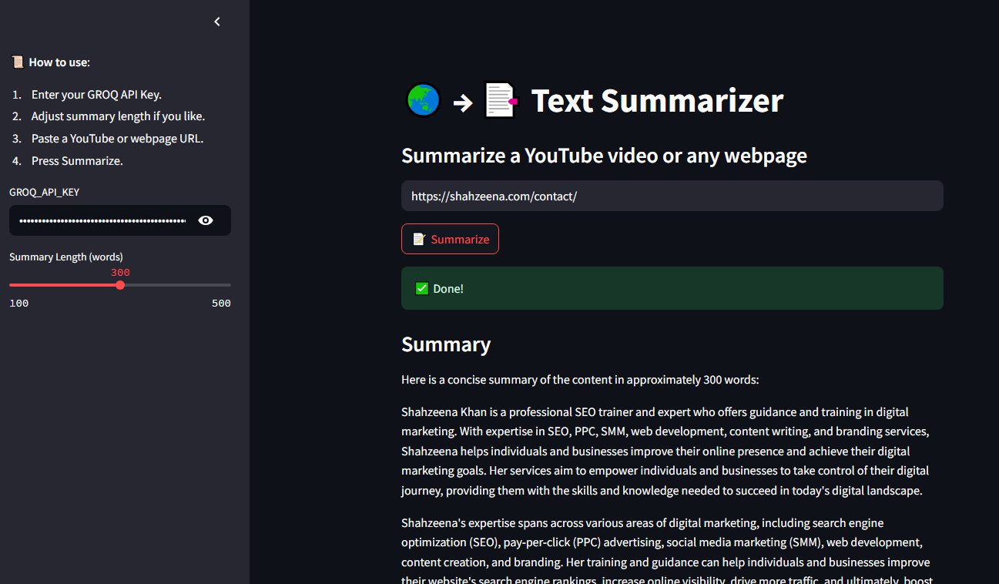

# 🎥 Youtube & Web Summarizer

A **Streamlit web app** that summarizes content from **YouTube videos** or **webpages** using **LangChain**, **Groq LLMs**, and **BeautifulSoup**.  
Easily generate concise summaries from long videos or web articles — just paste a link and click!

---

## 🚀 Features

- 🔗 Summarize **YouTube videos** using transcript API or yt-dlp fallback
- 🌍 Summarize **any webpage** by extracting clean text from `<p>` tags
- 🧠 Powered by **LangChain's LLM summarization chain**
- ⚡ Uses **Groq’s blazing-fast LLaMA 3 model** via API
- 🔒 API key hidden using `.env` file
- 🎛️ Adjustable summary length (100–500 words)

---

## 📸 Demo




> Replace this image with your own Streamlit app screenshot

---

## 🧩 Tech Stack

- Python
- Streamlit
- LangChain
- Groq API
- YouTube Transcript API
- yt-dlp (fallback)
- BeautifulSoup + Requests

---

## 🛠️ Installation

1. **Clone the repository:**

```bash
git clone https://github.com/ShahzeenaKhan/Youtube_Web_Summarizer.git
cd Youtube_Web_Summarizer
